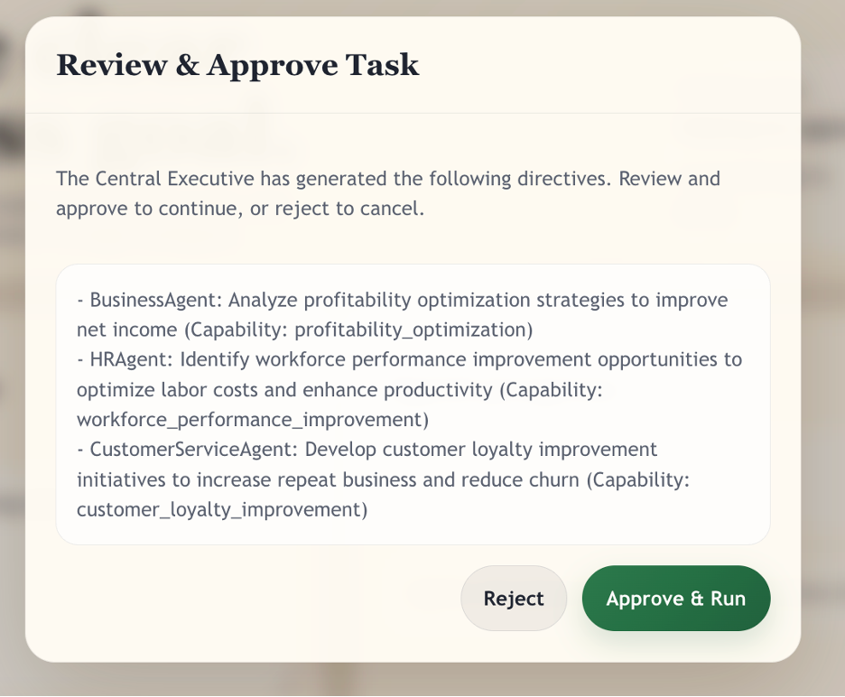
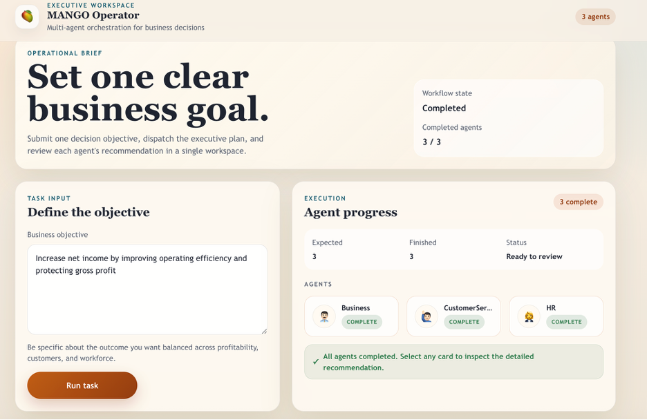
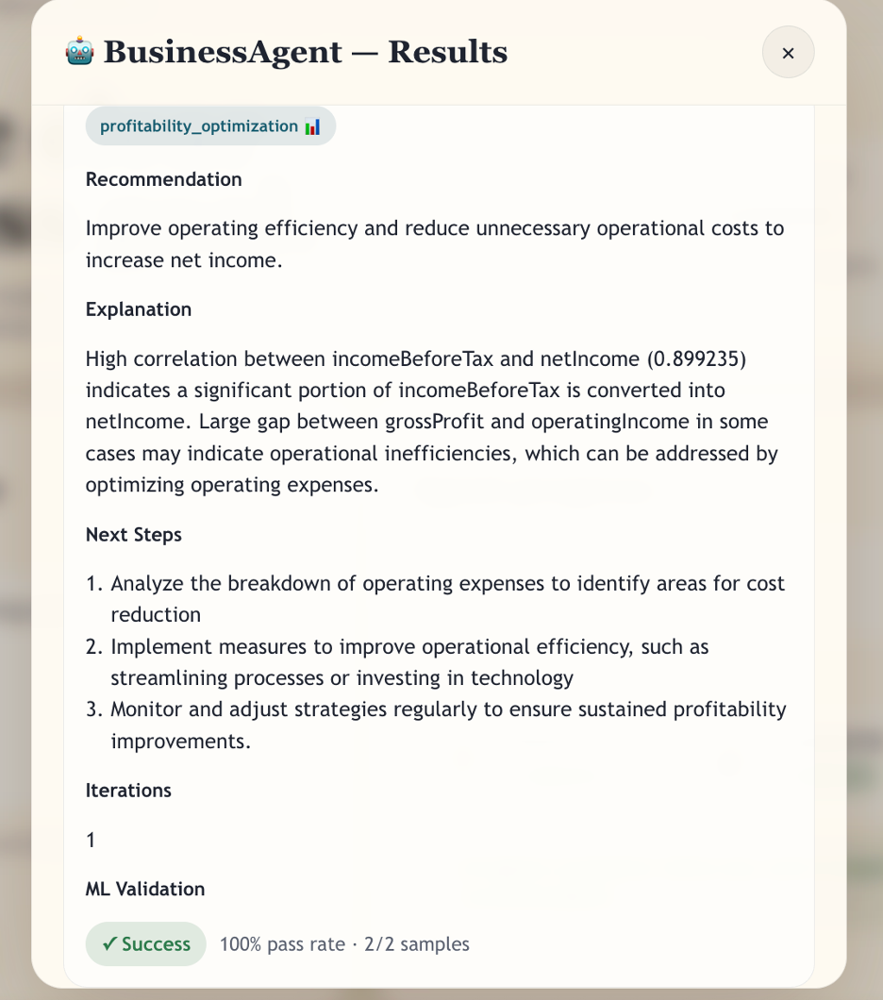

# MANGO: Managerial Agentic Network for General Orchestration

## Overview

MANGO (Managerial Agentic Network for General Orchestration) is a research framework for AI-assisted managerial decision-making.

A Central Executive (CE) receives a high-level objective, creates directives for specialized agents, triggers execution, and aggregates feedback. Agents use a ReAct-style reasoning loop with explicit tools to produce structured recommendations backed by validation signals.

## Key Features

- Agentic orchestration across multiple specialized agents.
- Central Executive task decomposition and directive routing.
- ReAct reasoning with explicit tool calls.
- Structured MCP message passing for directives and feedback.
- Autonomous and approval-based execution modes.
- Optional offline evaluation utilities for batch runs and judge scoring.

## Current Architecture

### Backend

- FastAPI services.
- CE orchestration logic in `agents/central_executive.py`.
- Agent reasoning engine in `agents/worker_network.py`.
- MCP transport in `services/mcp_server.py`.
- CE APIs in `services/ce_api.py`.
- Agent trigger API in `services/agent_api.py`.

### Frontend

- React JSX UI in `static/js/app.js` (Babel Standalone, no build step).
- Supports directive preview/approval (when non-autonomous) and agent result inspection.

### Agents

- Capability-driven agents: `BusinessAgent`, `CustomerServiceAgent`, `HRAgent`.
- Agents are triggered via HTTP and return outputs via MCP feedback envelopes.

## Agent Reasoning Flow

Each agent processes a directive through a LangGraph state machine:

1. `analyze`: runs dataset analysis context preparation.
2. `react`: runs a ReAct agent with explicit tools.
3. `finalize`: returns structured recommendation payload.

The ReAct step uses explicit tools, including ML validation (`validate_recommendation`), and can iterate up to a capped number of attempts before finalizing.

Final result payload includes:

- `recommendation`
- `explanation`
- `next_steps`
- `ml_validation`
- `iterations`

## API Endpoints

### Central Executive API

| Method | Path | Description |
|---|---|---|
| `POST` | `/run` | Submit a task. Returns `pending` (approval flow) or `running` (autonomous flow). |
| `POST` | `/approve` | Approve generated directives and start execution. |
| `POST` | `/reject` | Reject generated directives. |
| `GET` | `/results` | Returns `no_results`, workflow `error`, or aggregated agent feedback. |

### Agent API

| Method | Path | Description |
|---|---|---|
| `POST` | `/process-directive` | Returns `accepted` or `already_running`. |

Agent outputs are sent to CE through MCP `agent_feedback`.

## Model Provider Configuration

MANGO supports Ollama and OpenAI.

- Global provider/model:
  - `LLM_PROVIDER`
  - `LLM_MODEL`
- Judge-specific provider/model:
  - `JUDGE_LLM_PROVIDER`
  - `JUDGE_LLM_MODEL`

## Environment Variables

Environment setting (`.env`) keys include:

```dotenv
MCP_PORT=8000
CE_PORT=8001
BUSINESS_AGENT_PORT=8002
CUSTOMERS_AGENT_PORT=8003
HR_AGENT_PORT=8004
MCP_HOST=mcp

LLM_PROVIDER=ollama
LLM_MODEL=llama3.1
JUDGE_LLM_PROVIDER=ollama
JUDGE_LLM_MODEL=llama3.1
LLM_TEMPERATURE=0.2
OLLAMA_URL=http://host.docker.internal:11434
OPENAI_API_KEY={YOUR_API_KEY}

EMBEDDING_MODEL=sentence-transformers/all-MiniLM-L6-v2
TRAINED_MODELS_PATH=/app/models

AUTONOMOUS_MODE=true
EVALUATION_MODE=false
```

## Execution Modes

- `AUTONOMOUS_MODE=true`: directives are generated and workflow starts immediately.
- `AUTONOMOUS_MODE=false`: CE returns directives for approval before execution.

## Run with Docker

### Prerequisites

- Docker and Docker Compose.

### Start

```bash
./start_mango.sh
```

The startup script builds required images, runs validator training, and launches CE + MCP + enabled agent services.

### Stop

```bash
docker compose down
```

### UI

Open:

- `http://localhost:8001`

After opening the UI, enter a business task and click **Run**. The CE generates directives and starts agents immediately in autonomous mode, or shows a review screen in approval mode.

1. Enter task and run.
2. If `AUTONOMOUS_MODE=false`, review directives and approve.
3. Watch agent execution cards update in real time.
4. Open each agent result card to inspect recommendation, explanation, next steps, and validation.

Screenshots:

<p align="left">
  
  
  
</p>

## Evaluation (Optional)

For offline benchmarking, use scripts in `evaluation/`: run `python evaluation/run_tasks_batch.py` to collect task outputs, then `python evaluation/run_evaluation.py` to generate judged scores and a chart.
